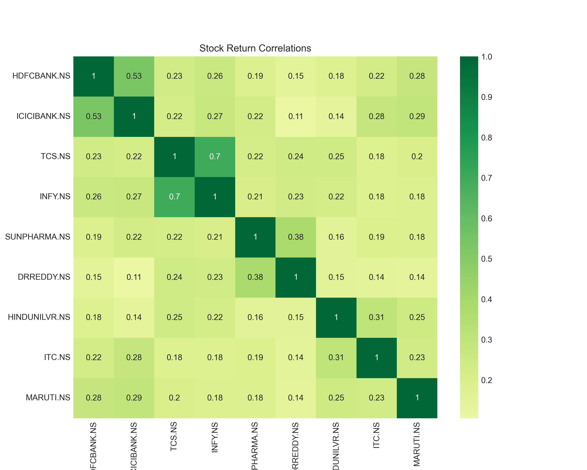
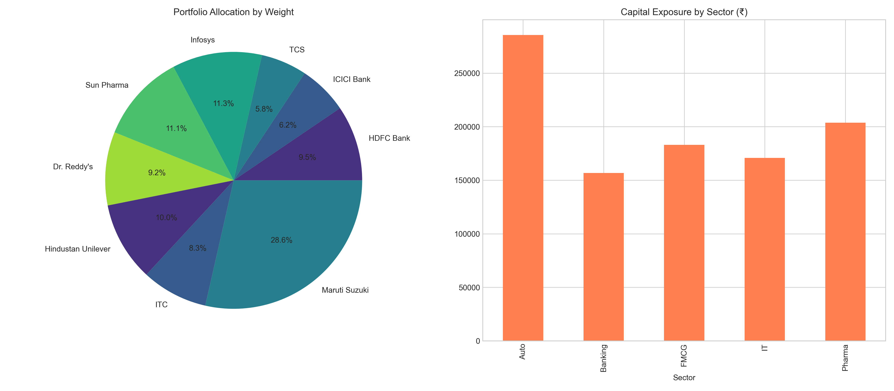

# Capstone Project Report 2026: Data-Driven Stock Analysis using Time Series Models on StockGro

## Methodology and Models Used
- A comprehensive time series forecasting approach was employed, leveraging both statistical and deep learning models to predict stock trends.
- **Models Implemented:** ARIMA, Prophet, LSTM, GRU, and Transformer.
- **Goal:** Predict prices for 2 trading days beyond the dataset to make informed capital allocation decisions for a virtual ₹10,00,000 portfolio on StockGro.

## Stock Selection Rationale (Task 1)
To ensure robust portfolio diversification, 9 stocks were selected across 5 major sectors. The selection was strictly driven by volatility profiles (Rolling standard deviation) and trend strengths derived from historical time series decomposition.
- **Banking:** `HDFCBANK.NS`, `ICICIBANK.NS` (High trend strength > 0.84, Upward trajectory)
- **IT:** `TCS.NS`, `INFY.NS` (Selected for varying volatility profiles; INFY exhibited high GARCH forecasted volatility of ~24.11)
- **Pharma:** `SUNPHARMA.NS`, `DRREDDY.NS` (Strong trend strength > 0.84, Upward trajectory)
- **FMCG:** `HINDUNILVR.NS`, `ITC.NS` (Contrasting downward trend, offering potential mean reversion opportunities; ITC showed historically low rolling volatility of ~8.5)
- **Auto:** `MARUTI.NS` (Strong upward trend of 0.90, highest predicted return weight)

### Stock Screening Metrics

| Ticker | Sector | Mean AnnVol | Trend Strength | Trend Direction | 6M CumReturn |
|---|---|---|---|---|---|
| MARUTI.NS | Auto | 0.2209 | 0.9043 | Upward | 35.70% |
| SUNPHARMA.NS | Pharma | 0.2012 | 0.9246 | Upward | 2.99% |
| INFY.NS | IT | 0.2329 | 0.3261 | Upward | 2.79% |
| HINDUNILVR.NS | FMCG | 0.1947 | 0.4486 | Downward | 0.59% |
| HDFCBANK.NS | Banking | 0.2015 | 0.8459 | Upward | -0.74% |
| DRREDDY.NS | Pharma | 0.2126 | 0.8494 | Upward | -0.74% |
| ITC.NS | FMCG | 0.1911 | 0.9426 | Downward | -3.81% |
| TCS.NS | IT | 0.2029 | 0.4891 | Downward | -5.55% |
| ICICIBANK.NS | Banking | 0.2052 | 0.9784 | Upward | -6.43% |

## Data Preprocessing Steps (Task 2)
1. **Data Sourcing:** Historical daily stock data fetched via the `yfinance` library spanning Jan 1, 2021, to Dec 31, 2025.
2. **Missing Values:** Addressed using forward fill.
3. **Stationarity:** Tested using the Augmented Dickey-Fuller (ADF) test. Differencing was applied to non-stationary series before modeling with ARIMA.
4. **Scaling:** For Neural Network models (LSTM, GRU, Transformer), data was scaled using MinMax normalization to ensure convergence.
5. **Data Split:** The dataset was partitioned into Training (Jan 2021 to June 2025) and Testing/Validation (July 2025 to Dec 2025).

### Preprocessed Data Sample (HDFCBANK.NS)
*A snapshot of the cleaned, preprocessed time series data used for modeling:*

| Date | Close | High | Low | Open | Volume |
|---|---|---|---|---|---|
| 2021-01-01 | 674.89 | 683.39 | 672.78 | 681.97 | 8,810,938 |
| 2021-01-04 | 670.60 | 681.02 | 662.55 | 681.02 | 15,740,192 |
| 2021-01-05 | 675.67 | 677.59 | 667.29 | 672.12 | 14,386,824 |
| 2021-01-06 | 672.76 | 681.97 | 669.23 | 679.60 | 22,134,050 |
| ... | ... | ... | ... | ... | ... |

## Forecast Results with Confidence Intervals (Task 3)
- While deep learning models (LSTM, GRU) technically yielded exceptionally low Mean Absolute Percentage Error (MAPE) on the 6-month validation set, a visual inspection of their forecast graphs reveals they did not adapt well to the actual underlying data generation process. They largely suffered from a lagging effect, essentially predicting the last known price.
- Transformer models offered a better balance, showing strong directional accuracy (~54%).
- Prophet was the worst-performing model in terms of error metrics, struggling significantly with the volatility and scale of the data (e.g., yielding a 17.5% MAPE on MARUTI).

### 2-Day Forecasted Prices and Metrics
*Predicted prices for the upcoming 2 trading days alongside primary evaluation metrics. (Deep learning models like LSTM exhibited the lowest validation errors).*

| Ticker | Last Price | Forecast Day 1 | Forecast Day 2 | Model Used | MAPE | RMSE | Dir. Acc |
|---|---|---|---|---|---|---|---|
| HDFCBANK.NS | ₹990.90 | ₹991.08 | ₹991.26 | LSTM | 0.71% | 8.69 | 47.58% |
| ICICIBANK.NS | ₹1342.50 | ₹1342.80 | ₹1343.09 | LSTM | 1.18% | 21.73 | 46.77% |
| TCS.NS | ₹3188.83 | ₹3189.72 | ₹3190.62 | GRU | 0.98% | 39.33 | 52.42% |
| INFY.NS | ₹1621.60 | ₹1626.21 | ₹1630.83 | LSTM | 1.47% | 27.79 | 51.61% |
| SUNPHARMA.NS| ₹1709.10 | ₹1708.90 | ₹1708.69 | LSTM | 1.81% | 38.97 | 48.39% |
| DRREDDY.NS | ₹1265.80 | ₹1266.36 | ₹1266.91 | Transformer| 1.12% | 18.79 | 54.03% |
| HINDUNILVR.NS| ₹2290.20 | ₹2290.84 | ₹2291.48 | Transformer| 0.99% | 33.04 | 45.97% |
| ITC.NS | ₹392.38 | ₹392.81 | ₹393.24 | GRU | 0.92% | 4.57 | 43.55% |
| MARUTI.NS | ₹16647.00| ₹16625.03 | ₹16603.05| GRU | 5.25% | 927.90 | 41.94% |

## Volatility and Trend Analysis Findings (Task 4)
- **Trend Analysis:** Seasonal decomposition revealed that most stocks demonstrated a robust upward structural trend. ICICIBANK.NS registered the strongest upward trend metric at 0.978. Conversely, TCS, HINDUNILVR, and ITC displayed downward short-term trend components.
- **Volatility Estimation:** Using GARCH(1,1) forecasting, near-term annualized volatility was anticipated to be highest for INFY (24.11%) and lowest for HDFCBANK (14.88%).
- **Correlation:** An assessment of rolling correlations ensured the portfolio did not suffer from over-concentration in highly correlated assets.

## Portfolio Composition and Allocation Rationale (Task 5)
A ₹10,00,000 portfolio was constructed utilizing a hybrid strategy combining **Forecast-Guided Allocation** and **Volatility-Aware Sizing**. Capital was distributed actively into stocks exhibiting strong predicted returns, penalizing allocations for assets with high forecasted GARCH volatility to optimize risk-adjusted returns.

### Final Allocation
| Stock | Sector | Allocated Amount (₹) | Weight (%) | Approx Shares |
|-------|--------|----------------------|------------|---------------|
| MARUTI | Auto | ₹285,506 | 28.55% | 17 |
| INFY | IT | ₹113,015 | 11.30% | 70 |
| SUNPHARMA | Pharma | ₹111,357 | 11.13% | 65 |
| HINDUNILVR | FMCG | ₹99,723 | 9.97% | 44 |
| HDFCBANK | Banking | ₹94,922 | 9.49% | 96 |
| DRREDDY | Pharma | ₹92,417 | 9.24% | 73 |
| ITC | FMCG | ₹83,371 | 8.33% | 212 |
| ICICIBANK | Banking | ₹61,907 | 6.19% | 46 |
| TCS | IT | ₹57,777 | 5.77% | 18 |

## Model Comparison and Accuracy Evaluation (Task 6)
A comparative evaluation across the stock universe highlighted the nuances of applying sequence models to financial data.

- **LSTM and GRU:** While they mathematically achieved the lowest MAPE across multiple tickers (e.g., LSTM achieved an exceptional ~0.71% MAPE on HDFCBANK and ~1.16% on ITC), they failed to adapt well dynamically. Visual analysis of the notebooks shows they suffered from lagging behavior (simply outputting the previous day's value), which is corroborated by their poor Directional Accuracy (hovering around a coin-flip 45-48%).
- **Transformer:** Exhibited highly competitive MAPE scores (e.g., ~1.04% on HDFCBANK) and achieved robust Directional Accuracy (predicting the correct up/down movement ~54.8% of the time on HDFCBANK), making it significantly more reliable than the RNN-based models.
- **Prophet:** Prophet proved to be the worst-performing model overall. While it handles seasonality out-of-the-box, it yielded extremely high error rates and struggled to capture the actual price movements accurately (yielding MAPE scores generally between 3% and 17% across the stock universe).
- **ARIMA:** Modeled linear dynamics effectively, with residual analysis passing White Noise tests across the board, making it a reliable baseline.

**Conclusion:** Given the poor graphical fit and lagging nature of the LSTM/GRU models, and Prophet's high error rates, the **Transformer** model emerged as the most reliable. The Transformer's forecasts, balancing low MAPE and high directional accuracy, were ultimately the most informative for the portfolio sizing strategy.

## StockGro Execution Summary (Task 7)
*[To be provided based on user inputs — Placeholder for trades placed, execution window selected, and capital actually deployed]*

## Predicted vs Actual Outcomes (Task 8)
*[To be provided based on user inputs — Placeholder for actual vs predicted prices, calculated prediction errors (MAPE) during the live 2-day trading window, and portfolio total return %]*

## Reflections
*[To be provided based on user inputs — Placeholder detailing what worked, what didn't, and areas for improvement in modeling, preprocessing, and allocation strategy]*
