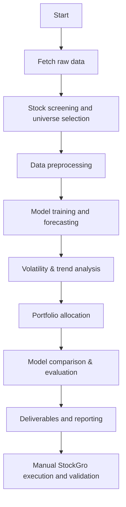

# Time Series Stock Analysis

## Project Overview

This repository contains a capstone project for time series stock analysis using historical NSE/BSE stock data. The goal is to build a complete pipeline from raw data acquisition and preprocessing through forecasting, volatility/trend analysis, portfolio allocation, and model comparison. The portfolio is then tested in real-time on Stockgro platform-virtual stock trading. 

The code covers the following core tasks:
- Stock universe screening and selection
- Data preprocessing and stationarity checks
- Forecasting using ARIMA, Prophet, LSTM, GRU, and Transformer models
- Volatility estimation and trend analysis using log returns, GARCH, and STL decomposition
- Portfolio construction using forecast guidance, volatility sizing, correlation diversification, and sector momentum
- Comparison of model performance using RMSE, MAPE, and directional accuracy

## DEPLOYED VISUAL DASHBOARD: 
https://data-driven-stock-analysis-using-time.onrender.com/

## Repository Structure

- `main_pipeline.py`: Orchestrates the main project workflow. It runs tasks 1 through 6 and saves deliverables.
- `config.py`: Defines training/testing date ranges, stock universe, sector mapping, forecast horizon, and capital amount.
- `requirements.txt`: Lists the Python packages required to run the project.
- `data/raw/`: Stores raw downloaded stock data CSV files.
- `data/preprocessed/`: Stores cleaned and preprocessed data files.
- `results/forecasts/`: Stores model forecast outputs for each ticker and model.
- `results/metrics/`: Stores aggregated model comparison metrics.
- `deliverables/`: Stores reports, tables, and analysis outputs for each task.
- `src/`: Contains modular code for data, analysis, models, portfolio, and utilities.

### `src/` directory

- `src/data/`: Data download, loading, screening, and preprocessing modules.
- `src/models/`: Forecasting model implementations.
- `src/analysis/`: Volatility, trend, and correlation analysis modules.
- `src/portfolio/`: Portfolio allocation logic.
- `src/utils/`: Shared utility functions, including evaluation metrics.

## Setup Instructions

1. Create a Python environment. Example:
   ```bash
   python -m venv venv
   source venv/bin/activate
   ```

2. Install dependencies:
   ```bash
   pip install -r requirements.txt
   ```

3. Run the pipeline using `main_pipeline.py`.

## How to Run the Pipeline

The pipeline is designed around six main tasks.
Use the task flags to execute specific steps or all tasks together.

```bash
python main_pipeline.py --task 1 2 3 4 5 6
```

If no `--task` argument is provided, the pipeline executes tasks 1 through 6 by default.

### Task mapping

- `1`: Stock universe screening and selection
- `2`: Data preprocessing and stationarity analysis
- `3`: Forecasting with ARIMA, Prophet, LSTM, GRU, and Transformer
- `4`: Volatility, trend, and correlation analysis
- `5`: Portfolio construction and allocation
- `6`: Model comparison and result summary

## Detailed Task and File Descriptions

### Task 1 — Stock universe selection and screening

Main entrypoint: `main_pipeline.py::task1_screening`

Key modules:
- `src/data/fetch_data.py`
- `src/data/screening.py`

What it does:
- Downloads historical NSE stock data for the selected tickers.
- Computes rolling volatility, seasonal decomposition, and momentum for each stock.
- Saves the screening report to `deliverables/tables/stock_screening_report.csv`.

Inputs:
- `STOCK_UNIVERSE` and `SECTOR_MAP` from `config.py`.
- Raw data from `data/raw` or fresh download via `fetch_all()`.

Outputs:
- A stock screening report containing sector, volatility, trend strength, and momentum.

### Task 2 — Data preprocessing

Main entrypoint: `main_pipeline.py::task2_preprocess`

Key module:
- `src/data/preprocess.py`

What it does:
- Loads raw stock CSV files from `data/raw`.
- Handles missing values with forward-fill and backward-fill.
- Performs stationarity checks using the Augmented Dickey-Fuller test.
- Applies differencing as needed to assess stationarity.
- Computes log returns and scales data for machine learning models.
- Splits data into training (before 2025-07-01) and testing (2025-07-01 to 2025-12-31).
- Saves cleaned data to `data/preprocessed`.

Outputs:
- `processed[ticker]` dictionaries containing raw close prices, log returns, train/test series, scaled arrays, scaler objects, and differencing order.

### Task 3 — Time series forecasting

Main entrypoint: `main_pipeline.py::task3_forecasting`

Models executed:
- `src/models/arima.py`
- `src/models/prophet_model.py`
- `src/models/lstm.py`
- `src/models/transformer.py`

What it does:
- Trains each model on the training set.
- Predicts stock prices over the test set.
- Forecasts the next 5 trading days beyond the available data.
- Evaluates each model using RMSE, MAPE, and directional accuracy.
- Writes forecasts to `results/forecasts` and metrics to `results/metrics/model_comparison.csv`.

Model details:
- `ARIMA`: Uses `pmdarima.auto_arima` for order selection and residual diagnostics.
- `Prophet`: Converts series into `ds`/`y` format and forecasts business days ahead.
- `LSTM` / `GRU`: Builds sequence-based recurrent networks with PyTorch.
- `Transformer`: Builds a Transformer encoder to forecast sequential price data.

Outputs:
- Test predictions per model and ticker.
- Future 5-day forecast arrays per model and ticker.
- Comparison metrics saved in `results/metrics/model_comparison.csv`.

### Task 4 — Volatility and trend analysis

Main entrypoint: `main_pipeline.py::task4_analysis`

Key modules:
- `src/analysis/volatility.py`
- `src/analysis/trend_analysis.py`
- `src/analysis/correlation.py`

What it does:
- Computes log return volatility using rolling windows and GARCH(1,1).
- Calculates trend strength and trend direction using STL decomposition.
- Builds a correlation matrix for the selected stock universe.
- Saves volatility and trend summary tables to `deliverables/task4_analysis`.

Outputs:
- `deliverables/task4_analysis/volatility_metrics.csv`
- `deliverables/task4_analysis/trend_metrics.csv`
- `deliverables/task4_analysis/correlation_matrix.csv`

### Task 5 — Portfolio construction and capital allocation

Main entrypoint: `main_pipeline.py::task5_portfolio`

Key module:
- `src/portfolio/allocation.py`

What it does:
- Selects a primary model forecast (currently ARIMA by default).
- Reads the most recent closing prices from raw data.
- Generates predicted return and allocation scores using:
  - forecast return
  - volatility estimate
  - correlation diversification weight
  - sector momentum
- Builds weights that sum to 1 and allocates ₹10,00,000 accordingly.
- Saves the portfolio allocation table to `deliverables/task5_portfolio/portfolio_allocation.csv`.

Outputs:
- Portfolio allocation with ticker, name, sector, price, predicted 5-day return, weight, amount, and approximate shares.

### Task 6 — Model comparison and selection

Main entrypoint: `main_pipeline.py::task6_comparison`

What it does:
- Prints a comparison of all model metrics.
- Computes average RMSE, MAPE, and directional accuracy by model.
- Identifies the best-performing model by average MAPE.

Outputs:
- A console summary and saved metrics file for reporting.

## Manual Tasks for StockGro were done

This repository prepares the data-driven analysis and portfolio recommendation. The final StockGro execution and validation steps were intended to be completed manually:

1. I registered for the event on StockGro and joined the "Portfolio - Time Series Analysis 2026" tracker.
2. I had to select a two-day execution window from 11 May 2025 through 15 May 2025. And I tested on 13 May 2026 and notes down the profit/loss returns on 14 May 2026. 
3. I  deployedthe ₹10,00,000 virtual capital using portfolio weights from Task 5.
4. I recorded the actual close prices, portfolio performance, and returns at the end of Day 2.
5. I compared predicted vs actual prices and returns, including directional accuracy.
6. I documented outcomes, compared model performance, and included reflection.

### THE RESULTS FOR THE TASK 7 AND 8 ARE GIVEN IN MY REPORT UPLOADED: 

## Deliverables and Expected Files

The project produces the following deliverables:

- `data/raw/`: Raw downloaded stock data.
- `data/preprocessed/`: Cleaned price data suitable for modeling.
- `results/forecasts/`: Forecast CSV files for each model and ticker.
- `results/metrics/model_comparison.csv`: Model evaluation summary.
- `deliverables/tables/stock_screening_report.csv`: Task 1 stock screening results.
- `deliverables/task4_analysis/volatility_metrics.csv`: Task 4 volatility report.
- `deliverables/task4_analysis/trend_metrics.csv`: Task 4 trend report.
- `deliverables/task4_analysis/correlation_matrix.csv`: Correlation heatmap data.
- `deliverables/task5_portfolio/portfolio_allocation.csv`: Task 5 allocation results.

## Recommended Usage

To reproduce the complete pipeline:

```bash
python main_pipeline.py --task 1 2 3 4 5 6
```

To run only preprocessing and modeling if raw data already exists:

```bash
python main_pipeline.py --task 2 3
```

To run only portfolio allocation from existing forecasts and analysis outputs:

```bash
python main_pipeline.py --task 5
```

## Flowchart of the Project




## Notes on Code and Extension

- `main_pipeline.py` is the main orchestration script. 
- The model modules are separated so new forecasting approaches can be added without changing the pipeline structure.
- The portfolio allocation method currently uses a combined score from forecast return, volatility, correlation, and sector momentum. This can be refined with explicit task-based weight strategies.

## Requirements

Install all dependencies from `requirements.txt`. The project uses:

- `pandas`, `numpy`, `matplotlib`, `seaborn`
- `scikit-learn`, `statsmodels`, `arch`, `pmdarima`
- `yfinance`, `prophet`
- `torch`
- `plotly`, `streamlit`, `jupyter`

## Contact and Notes

This README is intended to be self-contained so readers can understand the workflow without opening the Python source files. For implementation details, each `src/` module is already organized by task and may be examined if needed.

